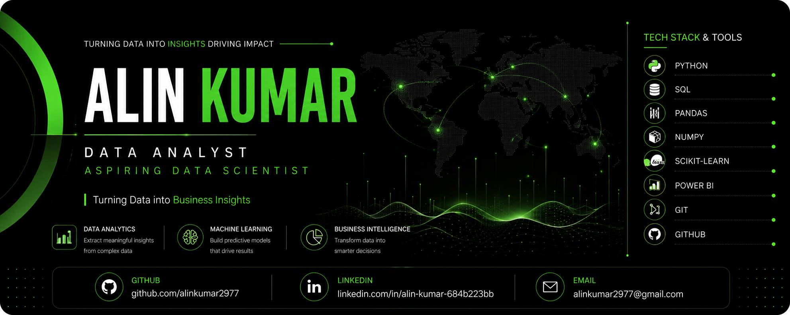

  

<!-- ========================================================= -->
<!--                     HERO SECTION                          -->
<!-- ========================================================= -->

  

&nbsp;

&nbsp;

 

<!-- ========================================================= -->
<!--                         ABOUT                             -->
<!-- ========================================================= -->

 

<table width="100%">

<tr>

<td width="64%" valign="top">

## Alin Kumar

### Data Analytics Student • Machine Learning Enthusiast

I'm passionate about transforming raw data into meaningful business insights through analytics, visualization, and machine learning.

My focus is on building practical, end-to-end data projects that combine clean data pipelines, analytical thinking, and business understanding to solve real-world problems.

Every repository in this profile reflects continuous learning, hands-on implementation, and a commitment to writing clean, maintainable code.

 

### Areas of Interest

- 📊 Data Analytics
- 🤖 Machine Learning
- 📈 Business Intelligence
- 📉 Data Visualization
- 🗄 SQL & Database Analytics
- ⚙ Feature Engineering

</td>

<td width="36%" valign="top">

<table>

<tr>

<td align="center">

### 🎓 Education

Data Analytics Student

</td>

</tr>

<tr>

<td align="center">

### 🚀 Current Focus

Building Real-World Projects

</td>

</tr>

<tr>

<td align="center">

### 🌱 Learning

Machine Learning

Explainable AI

</td>

</tr>

<tr>

<td align="center">

### 🎯 Goal

Creating Business Value Through Data

</td>

</tr>

</table>

</td>

</tr>

</table>

 

| 📍 Location | 💼 Focus | 🚀 Mission |
|:-----------:|:--------:|:----------:|
| India | Data Analytics & Machine Learning | Solving Real Business Problems with Data |

 

<!-- ========================================================= -->
<!--                    TECH ECOSYSTEM                         -->
<!-- ========================================================= -->

  

  

 

<!-- ========================================================= -->
<!--                    CORE EXPERTISE                         -->
<!-- ========================================================= -->

 

<table width="100%">

<tr>

<td width="33%" valign="top">

### 📊 Data Analytics

- ✔ Data Cleaning
- ✔ Exploratory Data Analysis
- ✔ Data Wrangling
- ✔ Statistical Analysis
- ✔ Business Insights

</td>

<td width="33%" valign="top">

### 🤖 Machine Learning

- ✔ Classification
- ✔ Regression
- ✔ Feature Engineering
- ✔ Model Evaluation
- ✔ Hyperparameter Tuning

</td>

<td width="34%" valign="top">

### 📈 Business Intelligence

- ✔ Power BI Dashboards
- ✔ Interactive Reports
- ✔ KPI Tracking
- ✔ Data Storytelling
- ✔ Business Recommendations

</td>

</tr>

</table>

 

<!-- ========================================================= -->
<!--                  WHAT DRIVES MY WORK                      -->
<!-- ========================================================= -->

 

| 🎯 Mindset | ⚡ Approach | 🚀 Goal |
|:----------:|:-----------:|:-------:|
| Learn by Building | Solve Real Business Problems | Create Practical Data Solutions |

 

> **"Every project is an opportunity to learn something new, improve my problem-solving skills, and transform data into meaningful business decisions."**

 

<!-- ========================================================= -->
<!--                   FEATURED PROJECTS                       -->
<!-- ========================================================= -->

 

<table width="100%">

<tr>

<td width="50%" valign="top">

## 📊 Telecom Customer Retention Analytics

An end-to-end Machine Learning project focused on predicting customer churn and generating actionable business insights.

### Highlights

- ✔ Data Cleaning & Preprocessing
- ✔ Exploratory Data Analysis
- ✔ Feature Engineering
- ✔ Machine Learning
- ✔ SHAP Explainability
- ✔ Business Recommendations

**Tech Stack**

`Python` `Pandas` `NumPy`
`Scikit-Learn` `SQL`
`Plotly`

</td>

<td width="50%" valign="top">

## 🎯 Lead Conversion Intelligence System

A predictive analytics solution built to identify high-potential leads using customer and marketing data.

### Highlights

- ✔ Data Cleaning
- ✔ Model Comparison
- ✔ Stacking Classifier
- ✔ SHAP Analysis
- ✔ Business Insights

**Tech Stack**

`Python`
`Pandas`
`Scikit-Learn`
`Power BI`
`SQL`

</td>

</tr>

</table>

 

<!-- ========================================================= -->
<!--                 CONTRIBUTION ACTIVITY                     -->
<!-- ========================================================= -->

  

 

<!-- ========================================================= -->
<!--                    LET'S CONNECT                          -->
<!-- ========================================================= -->

  

&nbsp;

&nbsp;

  

<h2>⭐ Thanks for Visiting!</h2>

If you enjoy exploring data-driven solutions, feel free to connect, collaborate, or check out my repositories.

 

