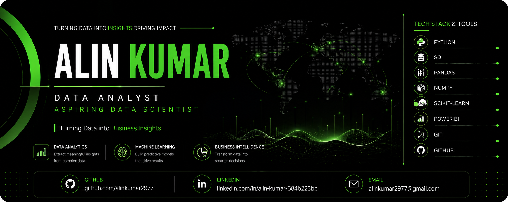

  

<!-- ========================================================= -->
<!--                        HERO                               -->
<!-- ========================================================= -->

  

<table>
<tr>
<td align="center">

</td>
<td align="center">

</td>
<td align="center">

</td>
</tr>
</table>

 

`DATA ANALYTICS` &nbsp;•&nbsp; `MACHINE LEARNING` &nbsp;•&nbsp; `BUSINESS INTELLIGENCE`

 

<!-- ========================================================= -->
<!--                         ABOUT                             -->
<!-- ========================================================= -->

 

<table width="100%">
<tr>

<td width="66%" valign="top">

# Alin Kumar

### Data Analytics Student · Machine Learning Enthusiast

I'm passionate about transforming **raw data into meaningful insights and practical solutions** through analytics, visualization and machine learning.

My projects cover the complete journey from **data preparation and EDA to modeling, evaluation and business insights**. I enjoy working on problems where data can help people make better decisions.

 

> **I learn by building — and build to solve real problems.**

</td>

<td width="34%" valign="top">

### 🎓 EDUCATION

**B.Sc. (Hons.) Computer Science**  
*Mathematics — Minor*

 

### 📍 BASED IN

**India 🇮🇳**

 

### 🎯 FOCUS

**Data · ML · AI · BI**

</td>

</tr>
</table>

 

<!-- ========================================================= -->
<!--                     QUICK PROFILE                         -->
<!-- ========================================================= -->

<table width="100%">
<tr>

<td align="center" width="25%">

### 📊
**DATA ANALYTICS**

EDA  
Visualization  
Business Insights

</td>

<td align="center" width="25%">

### 🤖
**MACHINE LEARNING**

Classification  
Ensemble Models  
Model Evaluation

</td>

<td align="center" width="25%">

### 🧠
**AI / COMPUTER VISION**

Deep Learning  
Transfer Learning  
Explainable AI

</td>

<td align="center" width="25%">

### 📈
**BUSINESS INTELLIGENCE**

Power BI  
SQL  
KPI & Reporting

</td>

</tr>
</table>

 

<!-- ========================================================= -->
<!--                    TECH ECOSYSTEM                         -->
<!-- ========================================================= -->

  

  

  

 

<!-- ========================================================= -->
<!--                    CORE EXPERTISE                         -->
<!-- ========================================================= -->

 

<table width="100%">
<tr>

<td width="33%" valign="top">

### 📊 Data Analytics

`Data Cleaning`  
`EDA`  
`Data Wrangling`  
`Statistics`  
`Visualization`  
`Business Insights`

</td>

<td width="33%" valign="top">

### 🤖 Machine Learning

`Classification`  
`Regression`  
`Feature Engineering`  
`Ensemble Learning`  
`XGBoost`  
`Hyperparameter Tuning`

</td>

<td width="34%" valign="top">

### 📈 BI & AI

`Power BI`  
`DAX`  
`SQL`  
`Deep Learning`  
`Computer Vision`  
`Explainable AI`

</td>

</tr>
</table>

 

<!-- ========================================================= -->
<!--                  WHAT DRIVES MY WORK                      -->
<!-- ========================================================= -->

  

<table width="90%">
<tr>
<td align="center">

### 🎯 PROBLEM

Start with a real-world question.

</td>
<td align="center">

### 🔍 DATA

Find patterns that matter.

</td>
<td align="center">

### ⚙️ MODEL

Build and evaluate the solution.

</td>
<td align="center">

### 💡 IMPACT

Turn results into useful decisions.

</td>
</tr>
</table>

 

> **Learn by building. Solve with data. Improve with every project.**

 

<!-- ========================================================= -->
<!--                   FEATURED PROJECTS                       -->
<!-- ========================================================= -->

  

 

<table width="100%">

<tr>

<td width="50%" valign="top">

## 🤖 AI Industrial Inspection

**Computer Vision • Deep Learning • Industrial AI**

AI-powered steel surface defect inspection using **EfficientNet-B0**, transfer learning and Grad-CAM across **10 industrial defect classes**.

**Performance**

| Metric | Score |
|:--|--:|
| Test Accuracy | **87.86%** |
| Test Macro F1 | **79.61%** |
| Validation F1 | **83.20%** |

`Python` `PyTorch` `EfficientNet-B0` `Grad-CAM` `Streamlit`

 

</td>

<td width="50%" valign="top">

## 💳 AI Financial Fraud Detection

**XGBoost • Risk Intelligence • Explainable AI**

End-to-end fraud detection system for imbalanced transaction classification with **hyperparameter tuning, threshold optimization and SHAP**.

**Performance**

| Metric | Score |
|:--|--:|
| Accuracy | **99.98%** |
| Precision | **97.37%** |
| Recall | **81.14%** |
| F1 Score | **88.52%** |
| ROC-AUC | **99.56%** |

`Python` `XGBoost` `Scikit-Learn` `SHAP`

 

</td>

</tr>

<tr>

<td width="50%" valign="top">

## 🎯 Lead Conversion Intelligence System

**Predictive Analytics • Machine Learning • Business Intelligence**

A predictive system designed to identify **high-potential leads** and estimate conversion probability from customer and marketing data.

**Final Model — Stacking Classifier**

| Metric | Score |
|:--|--:|
| Test Accuracy | **87.11%** |
| Precision | **80.78%** |
| Recall | **74.64%** |
| F1 Score | **77.59%** |

`Python` `Pandas` `Scikit-Learn` `XGBoost` `SQL` `Power BI`

 

</td>

<td width="50%" valign="top">

## 🧠 Brain Tumor Detection

**Deep Learning • Medical AI • Computer Vision**

Multi-class MRI classification using **EfficientNetB0 + Focal Loss**, with model explainability through visual interpretation techniques.

**Classes**

`Glioma` · `Meningioma` · `No Tumor` · `Pituitary`

**Performance**

| Metric | Score |
|:--|--:|
| Test Accuracy | **77.41%** |
| Macro F1 | **0.74** |
| Weighted F1 | **0.73** |

`Python` `PyTorch` `EfficientNetB0` `Focal Loss`

 

</td>

</tr>

<tr>

<td width="50%" valign="top">

## 📡 Telecom Customer Retention Analytics

**Machine Learning • Churn Analytics • Business Insights**

End-to-end customer churn prediction project focused on understanding retention drivers and generating actionable business recommendations.

**Workflow**

`Data Cleaning` → `EDA` → `Feature Engineering` → `ML` → `Evaluation` → `Insights`

`Python` `Pandas` `NumPy` `Scikit-Learn` `SQL` `Plotly` `XGBoost`

 

</td>

<td width="50%" valign="top">

## 📊 HR Recruitment Analytics Dashboard

**Power BI • Business Intelligence • Data Analytics**

Interactive recruitment dashboard designed to turn hiring data into clear **KPIs, trends and workforce insights**.

**Focus Areas**

`Recruitment KPIs` · `Hiring Trends` · `DAX` · `Power Query` · `SQL`

**Platform**

`Power BI`

 

</td>

</tr>

<tr>

<td width="50%" valign="top">

## ☕ Coffee Sales Analytics Dashboard

**Power BI • Business Intelligence • Data Analytics**

Interactive Power BI dashboard designed to analyze coffee sales performance, product demand, customer ordering patterns, payment behavior, and sales trends.

**Key Metrics**

| Metric | Value |
|:--|--:|
| Total Sales | **112.25K** |
| Average Money | **31.65** |
| Total Orders | **3,547** |
| Avg Sales / Day | **294.61** |

**Focus Areas**

`Sales Analysis` · `Product Performance` · `Payment Analysis` · `Time Trends`

`Power BI` `DAX` `Power Query` `Data Analytics`

 

</td>

<td width="50%" valign="top">

</td>

</tr>

</table>

 

`7 PROJECTS` &nbsp;•&nbsp; `ML + AI + BI` &nbsp;•&nbsp; `REAL-WORLD USE CASES`

 

<!-- ========================================================= -->
<!--                 CONTRIBUTION ACTIVITY                     -->
<!-- ========================================================= -->

  

 

<!-- ========================================================= -->
<!--                    LET'S CONNECT                          -->
<!-- ========================================================= -->

  

&nbsp;

&nbsp;

  

<h2>⭐ Thanks for Visiting!</h2>

If you enjoy exploring data-driven solutions, feel free to connect, collaborate, or check out my repositories.

 

